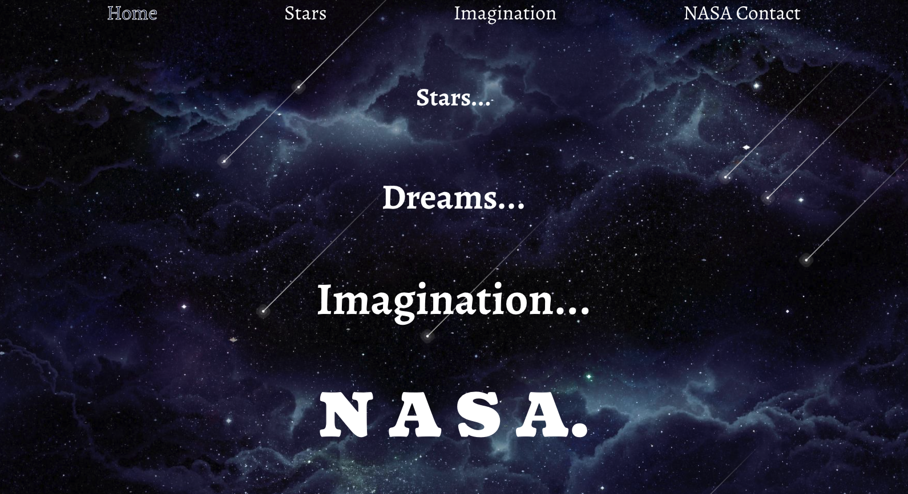
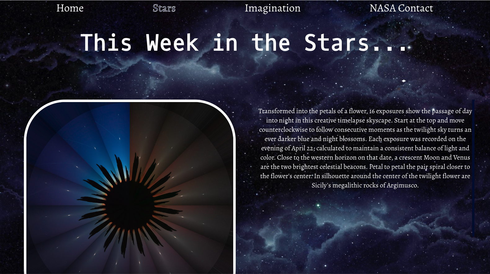
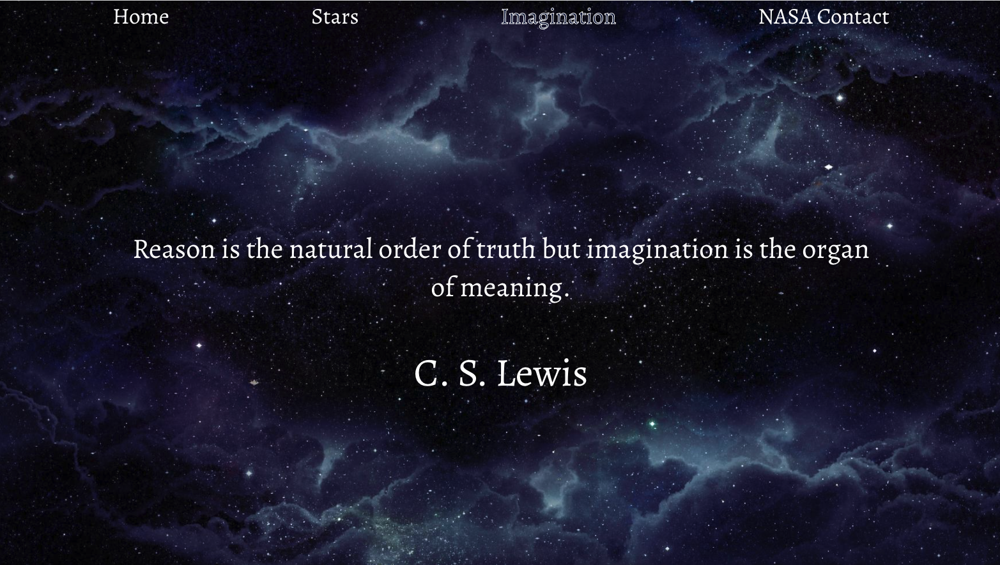
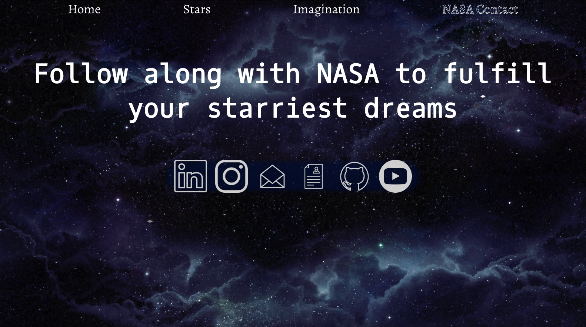
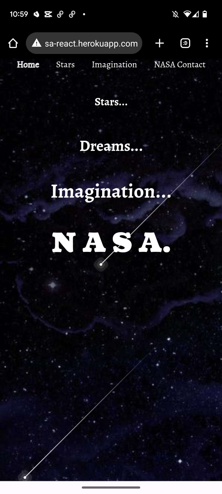
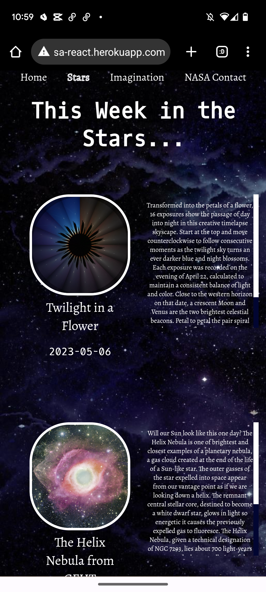
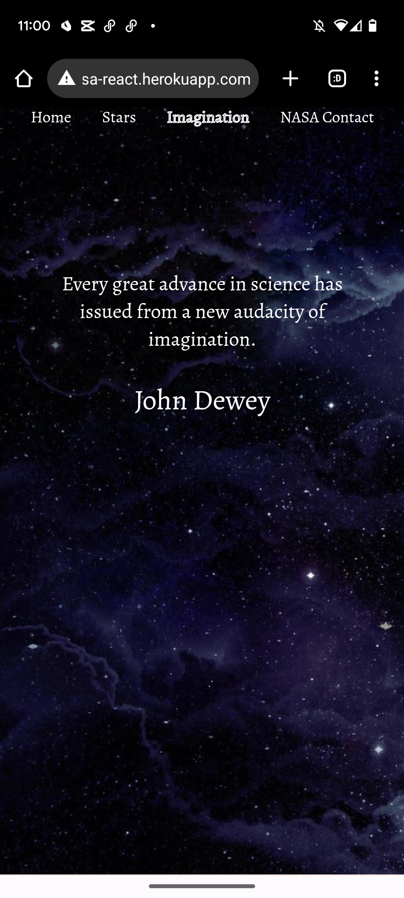
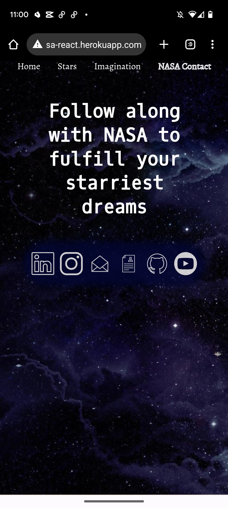

# Check out A Week In the Stars! <br> [nasa-react.herokuapp.com](https://nasa-react.herokuapp.com/)


<!-- TABLE OF CONTENTS -->
<details>
  <summary>Table of Contents</summary>
  <ol>
    <li>
      <a href="#about-the-project">About The Project</a>
      <ul>
        <li><a href="#built-with">Built With</a></li>
        <li><a href="#designed-with">Designed With</a></li>
        <li><a href="#planned-with">Planned With</a></li>
      </ul>
    </li>
    <li><a href="#images">Project Images</a></li>
    <li><a href="#installation">Installation</a></li>
    <li><a href="#contributing">Contributing</a></li>
    <li><a href="#enhancements">Planned Enhancements</a></li>
  </ol>
</details>


<!-- ABOUT THE PROJECT -->
## About The Project


This app is a reconceptualization of an app that I built in vanillaJS with dom manipulation almost 2 years ago as a gift for my mom so that she could see an image of the stars each day. When I was a kid we used to sit in front of our house and look up at the stars. It allowed me to imagine a world, and indeed a galaxy, much bigger than my small hometown. 

A Week in the Stars allows users to access the past weeks worth of astronomy images from the N.A.S.A. Astronomy Picture of the Day API on the "Stars" page and also allows user to access a randomly generated quote about imagining and imagination from the API Ninjas quote API. In addition, users can access the N.A.S.A Contact page where they can find N.A.S.A's social media pages in order to follow along with all of the amazing media N.A.S.A produces about the stars and our universe.

My hope is that this combination of imagery and quotes will allow users, especially users in areas where stars are less visible, to access their imaginations as to how wide the universe can be. 


### Built With


### Designed With
#### [Figma](https://www.figma.com/file/GpVCoQAZ8vDEKJUqFdAm51/A-Week-in-the-Stars?type=design&node-id=0-1&t=xzJFCWbfeyBMBONj-0)<br>  <br>


### Planned With
#### [Trello](https://trello.com/b/hbpNT1wF/a-week-in-the-stars) <br> 


## Images

images of the four pages on desktop:

<br>

<br>

<br>

<br>

images of the app on mobile:
<div>


</div>

<div>


</div>

<p align="right">(<a href="#readme-top">back to top</a>)</p>

## Installation
 
1. Clone the repo
   ```sh
   git clone git@github.com:smgraywood/NASA_React.git
   ```
2. Download the required packages
   ```sh
   npm i
   ```
3. Get to coding! 😃 

<p align="right">(<a href="#readme-top">back to top</a>)</p>

<!-- CONTRIBUTING -->
## Contributing

Contributions are what make the open source community such an amazing place to learn, inspire, and create. Any contributions you make are **greatly appreciated**.

If you have a suggestion that would make this better, please fork the repo and create a pull request. You can also simply open an issue with the tag "enhancement".
Don't forget to give the project a star! Thanks again!

1. Fork the Project
2. Go through the Installation Process
3. Create your Feature Branch (`git checkout -b feature/AmazingFeature`)
4. Commit your Changes (`git commit -m 'Add some AmazingFeature'`)
5. Push to the Branch (`git push origin feature/AmazingFeature`)
6. Open a Pull Request

<p align="right">(<a href="#readme-top">back to top</a>)</p>

<!-- PLANNED ENHANCEMENTS -->
## Enhancements

- [ ] Add more pages using the other NASA APIs to allow users to see more images of our galaxy
- [ ] Create a custom backend for quotes about imagination
- [ ] Create a database that allows users to upload their own images of the stars
- [ ] implement OAuth so that users could keep a database of their own star images

<p align="right">(<a href="#readme-top">back to top</a>)</p>